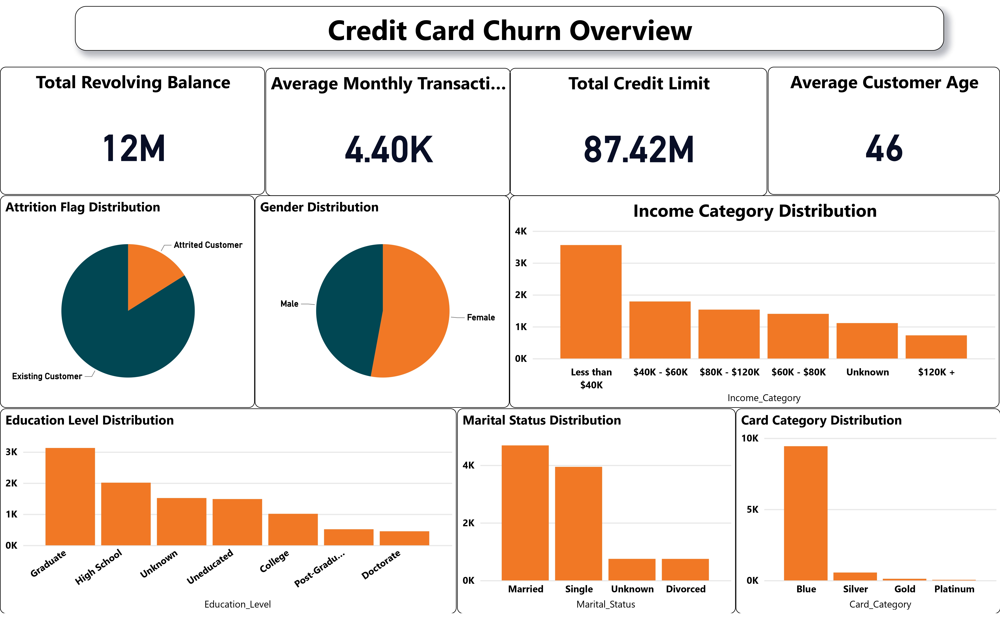
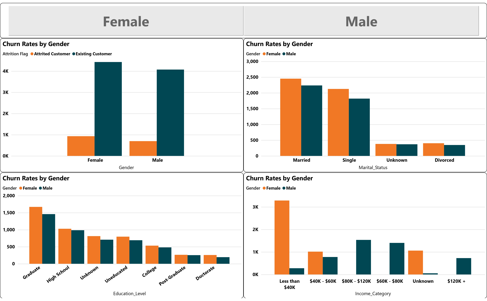

# Credit Card Churn Prediction

## 1. Power BI Dashboard

Explore the visualizations and insights derived from the Credit Card Churn dataset using Power BI.

## Dashboard Screenshots

## Dashboard Link

Visit the [published Power BI dashboard](https://app.powerbi.com/links/q40DMSCHhS?ctid=cc9971dc-be22-40f0-9825-3f01fb8995d2&pbi_source=linkShare) to interact with the live version.

### Screen: Overview





### How to View the Power BI Dashboard

To view the complete Power BI dashboard:

1. Download the PDF document [here](images/final_bi_last.pdf).
2. Open the PDF using a compatible viewer.

## 2. Python

### Introduction

The Credit Card Churn Prediction project aims to analyze and predict customer churn within the bank's credit card services. The dataset, sourced from [Analyttica](https://leaps.analyttica.com/home), comprises information on 10,000 customers, including demographic and financial attributes.

### Dataset Overview

The dataset includes the following columns:
The following are the column names present in the Credit Card Churn dataset:

1. `CLIENTNUM`: Customer ID
2. `Attrition_Flag`: Churn status (Existing Customer/Attrited Customer)
3. `Customer_Age`: Age of the customer
4. `Gender`: Customer gender (M/F)
5. `Dependent_count`: Number of dependents
6. `Education_Level`: Education level of the customer
7. `Marital_Status`: Marital status of the customer
8. `Income_Category`: Income category of the customer
9. `Card_Category`: Type of credit card (Blue, Silver, Gold, Platinum)
10. `Months_on_book`: Number of months the customer has been with the bank
11. `Total_Relationship_Count`: Total number of products held by the customer
12. `Months_Inactive_12_mon`: Number of months with no transactions in the last 12 months
13. `Contacts_Count_12_mon`: Number of contacts with the bank in the last 12 months
14. `Credit_Limit`: Credit limit on the credit card
15. `Total_Revolving_Bal`: Total revolving balance on the credit card
16. `Avg_Open_To_Buy`: Average open-to-buy credit line (credit limit - revolving balance)
17. `Total_Amt_Chng_Q4_Q1`: Change in transaction amount (Q4 over Q1)
18. `Total_Trans_Amt`: Total transaction amount in the last 12 months
19. `Total_Trans_Ct`: Total transaction count in the last 12 months
20. `Total_Ct_Chng_Q4_Q1`: Change in transaction count (Q4 over Q1)
21. `Avg_Utilization_Ratio`: Average card utilization ratio
22. `Naive_Bayes_Classifier_Attrition_Flag_Card_Category_Contacts_Count_12_mon_Dependent_count_Education_Level_Months_Inactive_12_mon_1`: Naive Bayes classifier score 1
23. `Naive_Bayes_Classifier_Attrition_Flag_Card_Category_Contacts_Count_12_mon_Dependent_count_Education_Level_Months_Inactive_12_mon_2`: Naive Bayes classifier score 2


### Getting Started

1. Clone the repository:

   ```bash
   git clone [https://github.com/fazal-coder/NED_final_project.git]
   ```
